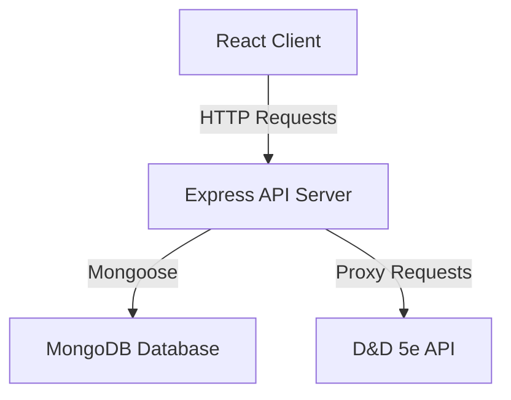

# D&D Campaign Companion

## Description

A web application designed to enhance the Dungeons & Dragons experience by providing tools for campaign management, character creation, and session organization.

---

## Context

D&D players and DMs often struggle to keep track of complex campaign details, character information, and game rules across multiple sessions, leading to unnecessary effort and time expended on managing the details from previous sessions and planning with less time left to play. A combination of these effects often demotivates a lot of players from starting new campaigns and causes potential DMs to view the responsibilities of a DM as daunting and something that only experienced players are able to do.

This application aims to act as a companion to the DM by providing an easily accessible store of relevant information to the DM's campaign. Users are able to access a campaign overview screen where they can see the characters in a campaign and read the session notes at a glance and search for spells and items with a search box on this page. The functionality to create and modify campaigns and characters is also provided for users to play in any number of adventures. The management of campaign details will be protected using a roles-based authentication system for the DM only. For non-DMs, this app is still useful for tracking the current state of their characters on the My Characters view of the application.

All of these features help to lighten the workload on the DM and frees them to spend their time on more creative aspects of their session planning and enable users to play more. This app is for D&D players and Dungeon Masters of all experience levels.

---

## Features

- Campaign creation and management
- Character creation and management
- Session notes
- Spell and item lookup using D&D 5e API

## Architecture

- Built with React, the front-end handles current campaign management views, user character profiles, and spell and item browsing components
- Server-Side Application: A Node.js/Express application in the Model-Controller-Service pattern as a RESTful API for the client-side application
- Database: A MongoDB database to store user data, campaign information, and other application-specific data

## Architecture Diagram

## Tech Stack

- Frontend: React, Bootstrap
- Backend: Node.js, Express, Mongoose
- Database: MongoDB
- External API: D&D 5e API
- Testing: Jest, React Testing Library
- Deployment: GitHub
